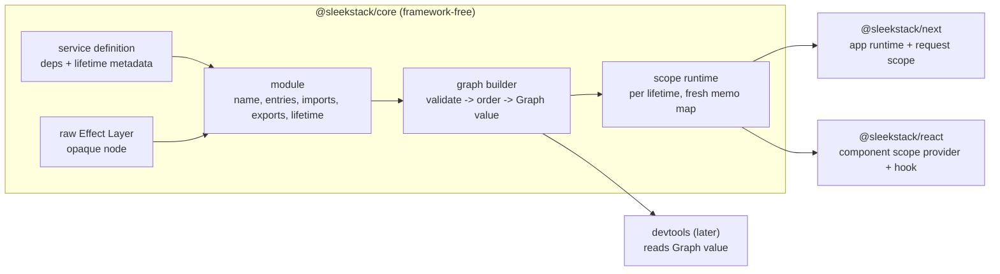

# SleekStack: Effect-native DI, modules, and React/Next adapters

## Conversation Evidence

- "I want to PLAN the whole project from beginning and i need brainstorming"
- "A unified runtime architecture for full-stack TypeScript applications."
- "it's just a dependency injection and service layer + modules management"
- Offered fork A (Effect-native DI) / B (DI hiding Effect) / C (no Effect) -> "A, Effect is hard requirement"
- Offered pains 1-7 and modules b (auto-wiring) + d (lifetime-scoped) + e (graph as data) -> "all no overreach"
- Offered hybrid: raw Effect Layers accepted as opaque, SleekStack service() helper carries dependency metadata, ADR 0001 amended -> "yes"
- Agent proposal carried to capture: lifetimes app/request/component only; build order spike -> core -> next -> react -> devtools
- Earlier in session: prototype failures under React StrictMode, undefined-valued services, async parent layers, finalizer ordering, CI not running tests

## Overview

SleekStack is a dependency-injection and service layer with module management for full-stack TypeScript apps, built on Effect, for developers already using Effect. [user] It adds what Effect lacks at application scale: auto-wiring with readable errors, modules with boundaries, lifetime-scoped services (app / request / component) with captive-dependency checks, an inspectable dependency graph, and adapters that bind lifetimes to Next.js requests and React component trees. [paraphrase]

The build order is deliberate: a framework-free engine first (provable in plain Node), then the Next adapter (request scopes validate the engine without React lifecycle hazards), then the React adapter last. Two previous attempts failed on React lifecycle mechanics, not on the concept. [paraphrase]

## Goal & Context
<!-- scope: business -->

Effect already supplies Tags, Layers, and Scopes, but Layers expose dependencies only at the type level, so an application with dozens of services suffers wiring order bugs, unreadable missing-requirement type errors, accidental duplicate construction, no module boundaries, and no guard against a long-lived service capturing a short-lived one. SleekStack targets those pains for Effect users. [paraphrase]

## Architecture & Data Models
<!-- scope: technical -->



- **Service definition:** a SleekStack helper producing an Effect Layer plus runtime metadata (provided Tag, required Tags, lifetime). Required Tags are declared once and the Layer's requirement type is derived from them, so the metadata and the type cannot drift. [paraphrase]
- **Raw Layers:** accepted in two forms. (a) **Bare** raw Layer: must be self-contained (requirement type `never`, enforced by the types; compose dependent raw Layers yourself before passing them in); opaque node; takes the lifetime of the containing module (default `app`); merged into a base built before all metadata-carrying services; service definitions **cannot** rely on Tags it provides, because the graph cannot see them. (b) **Declared** raw Layer: a raw Layer wrapped with a declaration of the Tags it provides and requires; a full graph node participating in ordering, dependency validation, and lifetime checks in both directions.
- **Module:** named group of entries, with imports (pulled in transitively; either module values or a thunk returning modules, for forward references), exports (**descriptive metadata only**: the Graph marks non-exported nodes as private; no compile-time or runtime enforcement in this spec, amending ADR 0002), and an optional default lifetime for its entries. Module identity is object identity, never name.
- **Validation boundaries:** `module()` validates its own structure synchronously at definition time (non-empty name, entry shapes). `buildGraph` validates everything that needs the whole graph: import cycles by object identity (only reachable through thunk imports) with full path, duplicate module names (distinct objects sharing a name), diamond dedupe (the same module or entry object reached via several paths counts once, all paths kept as provenance), dependency satisfaction, dependency cycles between services, ambiguous providers, lifetime rules. **All graph validation completes before any construction**, so a validation error never leaves partially built services.
- **Lifetime matrix:** `app` may depend on `app`; `request` on `app` + `request`; `component` on `app` + `component`. `request` <-> `component` is always rejected (the two scopes never nest).
- **Boundary ownership:** each adapter root owns an app scope (Next: the configured global runtime; React: a top-level provider with no parent provider creates and owns one). Entries supplied at a child boundary (Next per-operation `provide`, nested React provider) are **built in that child scope** with their lifetime coerced to the child's lifetime, shadowing parent instances for that boundary only.
- **Graph value:** two layers. The internal executable graph holds Tags and Layers. `snapshot(graph)` returns a **serializable** GraphSnapshot DTO: nodes keyed by canonical Tag key (or a generated opaque id), display name, lifetime, owning module id + name, private flag, opaque flag; primitive edge records; shadowing records (winner id, shadowed ids). The DTO is the future devtools contract.
- **Scope runtime:** one scope instance per lifetime instance. Child scopes (request, component) build their own layers with a fresh memo map, reading parent-lifetime services from the parent context; parent services are never rebuilt in a child. Closing a scope runs finalizers in reverse acquisition order; a failed finalizer does not stop the rest.
- **Cleanup error contract:** closing a scope yields an Exit whose Cause aggregates every finalizer failure. Where no caller awaits the close (Next after a successful operation, React unmount), failures go to a reporting sink (`onFinalizerError`, configurable at the adapter root, default `console.error`); the operation's own result is unchanged.
- **Next adapter:** app runtime created lazily on first use from the configure call and held in a process-global slot that survives dev HMR. Re-configuration: the same config reference is a no-op; a different config disposes the existing app scope and replaces it (dev warning). Each server action / server read runs in its own request scope, closed when the operation returns or throws (not via post-response hooks). Stream-shaped results (ReadableStream / async iterable) are **rejected** in this spec with a descriptive error, because the scope would close before consumption; stream-aware finalization is deferred.
- **React adapter:** provider owns a component scope; the hook reads a per-scope cache with a discriminated status (pending / resolved / rejected), suspends on pending, throws rejected to the nearest error boundary, returns resolved synchronously (including `undefined`). Provider lifecycle is designed to survive StrictMode setup -> cleanup -> setup.

## API Contracts
<!-- scope: technical -->

Signatures (shape, not implementation):

- `service(tag, { requires?: readonly [TagA, TagB, ...], lifetime?: 'app' | 'request' | 'component' }, make: (deps: readonly [A, B, ...]) => Effect<Service, E, Scope>)` -> service definition (a Layer with metadata). `deps` is a tuple of resolved services in `requires` order; `Scope` in the requirement allows acquire/release resources finalized with the owning scope; `E` becomes the Layer's error channel. Compile-time tests tie `requires` to the tuple types and to the Layer's requirement type.
- `module({ name: string, entries: Array<ServiceDefinition | DeclaredLayer | Layer<Out, E, never>>, imports?: Module[] | (() => Module[]), exports?: Tag[], lifetime?: Lifetime })` -> Module
- `declareLayer(layer, { provides: Tag[], requires?: Tag[], lifetime? })` -> declared raw Layer (full graph node)
- `buildGraph(entries)` -> `Graph` or throws `GraphError` (tagged: `MissingDependency`, `DependencyCycle`, `AmbiguousProvider`, `CaptiveDependency`, `ModuleCycle`, `DuplicateModule`, `InvalidModule`); `snapshot(graph)` -> GraphSnapshot
- Scope close -> `Exit` with aggregated finalizer Cause; adapter roots accept `onFinalizerError(cause)` (default `console.error`)
- Next: `configureRuntime({ provide, onFinalizerError? })`; `action(fn)` / `action({ provide }, fn)` where `fn: (...args: A) => Effect<R, E, Services>` (write the body with `Effect.gen`), returning a callable `(...args: A) => Promise<R>`; each call opens one request scope, runs `fn(...args)`, checks the success value for stream shapes, then closes the scope and settles. A typed failure or defect rejects the Promise with an `Error` whose `cause` carries the Effect Cause. `query` has the identical shape (separate name for reads).
- React: `<LayerProvider provide={[...]}>`, `useService(tag)`

## Edge Cases & Constraints
<!-- scope: technical -->

- Diamond imports are legal and deduplicated by identity; only true identity cycles error (DFS approach from the prototype, switched from names to object identity).
- Same Tag at the same precedence from two entries -> `AmbiguousProvider`, never silent last-wins.
- A raw Layer's requirements are invisible: a missing requirement inside a raw Layer surfaces as Effect's own construction failure, wrapped with the owning module name.
- Construction failure after validation closes the scope, finalizing everything already acquired.
- Concurrent Next requests must never share request-scoped instances (security boundary, not just hygiene).
- Tag modules imported by client code must not drag server implementations into the client bundle: Tags and service definitions live in separable modules, and the playground bundle proves it (R11).
- React StrictMode double-invoke, Suspense retries, and nested providers over async parents are required cases.

## Acceptance Criteria
<!-- scope: both -->

- **R1:** A spike demonstrates, for ~5 helper-defined services, automatic topological wiring and one readable missing-dependency error naming the requiring service and the missing Tag; outcome decides go/no-go for the hybrid approach. Errors: spike failure is recorded as a decision in the spec's Decision Context, not silently worked around. [paraphrase]
- **R2:** Modules group services and raw Layers with a required name, imports (values or forward-reference thunks), and exports (descriptive; marks private nodes in the graph). Errors: missing/empty name thrown synchronously by `module()`; identity import cycles (full path), duplicate module names (distinct objects, same name) rejected by `buildGraph`; diamond imports of the same object are not errors. [paraphrase]
- **R3:** Service definitions and declared raw Layers may be listed in any order and depend on each other in both directions; the engine derives construction order. Bare raw Layers must be self-contained (no requirements), form a base built first, and cannot satisfy service-definition requirements. Errors: dependency cycle between services/declared Layers -> `DependencyCycle` with full Tag path; unsatisfied dependency (including one only a bare raw Layer provides) -> error naming requiring service, missing Tag, and the module it was expected from; ambiguous provider for the same Tag at the same precedence -> error. [paraphrase]
- **R4:** Shadowing: a more local entry satisfying a Tag overrides a transitive one from module imports; no separate override API. Errors: no error surface beyond R3. [paraphrase]
- **R5:** Lifetime safety per the lifetime matrix (app <- app; request <- app, request; component <- app, component) is enforced when the graph is built, and at the type level where feasible. Errors: violation names both services and their lifetimes; request <-> component always rejected; bare raw Layers are excluded (opaque), declared raw Layers are checked. [paraphrase]
- **R6:** Each shared service is constructed at most once per scope instance, and finalizers run in reverse acquisition order when the scope closes, including on failure. Errors: construction failure mid-build finalizes already-acquired services; a failing finalizer does not stop later ones; failures surface in the close Exit, or in the `onFinalizerError` sink where nothing awaits the close.
- **R7:** The resolved graph is exposed as a serializable snapshot listing nodes (canonical Tag keys), dependencies, lifetimes, owning module, private flag, and shadowing; raw Layers appear as opaque nodes; the snapshot round-trips through JSON. Errors: no error surface beyond R3. [paraphrase]
- **R8:** Next adapter: a global app runtime is configured once (same config again is a no-op; a different config disposes and replaces the app scope); server actions and server reads run in an isolated request scope finalized after completion or failure; per-operation provide entries are built in that request scope and shadow the global graph for that operation only. Errors: action/query invoked before configuration -> descriptive error at call time; stream-shaped result -> descriptive error; concurrent requests never share request-scoped instances.
- **R9:** React adapter: a provider scopes component-lifetime services to its subtree; the hook suspends on first async acquisition and returns synchronously thereafter, works with undefined-valued services, supports nesting over async parents, finalizes inner before outer, and behaves correctly under StrictMode double-mount. Errors: missing service -> descriptive error; acquisition failure -> nearest error boundary. [paraphrase]
- **R10:** CI runs typecheck and the full test suite for every library package (core, react, next) on every push to the default branch and on pull requests, and fails if any of them lacks the scripts; React adapter tests run under StrictMode. The CLI name-reservation shim has no logic and is excluded. Errors: no error surface beyond CI failure.
- **R11:** A client bundle that imports only Tags does not contain server-only service implementations. Errors: no error surface beyond the bundle check failing.

## Boundaries
<!-- scope: business -->

- Not for non-Effect users; no API that hides Effect entirely. [user]
- Lifetimes limited to app / request / component; session, transient, and job lifetimes deferred. [paraphrase]
- Module exports are not enforced at compile time or runtime; they are descriptive graph metadata (amends ADR 0002). [paraphrase]
- SSR-to-client hydration handoff of resolved services deferred. [paraphrase]
- Stream-aware request-scope finalization deferred; streams are rejected for now.
- Devtools UI deferred until graph data exists; only the Graph value shape is in scope. [paraphrase]
- No build/publish pipeline this spec: packages stay source-consumed inside the monorepo. [inferred]
- The untracked `sleek-codes` app is out of scope. [inferred]
- Not a framework: no folder conventions, no replacement for React/Next. [inferred]

## Decision Context
<!-- scope: both -->

- Effect-native DI chosen over DI-hiding-Effect and a custom container: the only option not competing head-on with Inversify/Nest, and Effect is a hard requirement. [user]
- Hybrid inputs chosen because auto-wiring, lifetime checks, and graph data need runtime metadata Effect Layers do not carry; this supersedes ADR 0001's "core exports only module()" via a new ADR. [paraphrase]
- Next before React: request scopes validate the engine without StrictMode/Suspense hazards that broke both prior attempts. [paraphrase]
- Rejected: a hand-maintained dependency list separate from types (drifts silently); rebuilding the app runtime per request (defeats memoization); post-response hooks for request-scope close (cannot read request data, errors never reach the caller).
- **Spike outcome (task .2): GO for the hybrid approach.** `service(tag, { requires, lifetime }, make)` carries runtime metadata that drives Kahn ordering (5 services in shuffled order wire and run), a readable `MissingDependency` ("Service \"Repo\" requires \"Db\", but no entry provides it") and `DependencyCycle` with Tag path; the Layer requirement type is derived from `requires`. Type-level captive check (`CaptiveViolations<Defs>`, readable violation strings) on a 50-service synthetic graph plus a 51-service violating variant: tsc check time 0.17-0.21s -> 0.22-0.24s (~+0.03s), instantiations 37.6k -> 100.4k (quadratic in graph size). Affordable at this scale: keep the type-level check as an opt-in over the full definition tuple, with the runtime check in `buildGraph` authoritative.
- Prior art reviewed: mcrovero/effect-nextjs (per-invocation context, process-global runtime; no graph or lifetime checks) and tim-smart/effect-atom (per-scope runtime + Suspense hooks). Both inform, neither is adopted as a dependency.
- **Lifecycle probe outcome (task .6): deferred dispose, not rebuild-on-remount.** Both strategies were implemented directly over core's scope runtime (`AppScope.child('component', entries)`, the primitive task .7's provider is rewritten on) and exercised under `renderStrict` (StrictMode double-invoke: mount -> cleanup -> remount, synchronous). Deferred dispose (cleanup schedules the scope's `dispose()` on a microtask; a remount before that microtask cancels it and keeps the same scope) produced exactly one acquisition and one release across the whole double-invoke cycle, with the component scope's context never exposing a disposed instance to any render. Rebuild-on-remount (cleanup disposes immediately and nulls the ref; a forced re-render rebuilds a fresh scope) worked correctly (no consumer ever observed a disposed instance either) but paid for a spurious acquire+dispose pair every StrictMode mount, plus an extra render pass — pure StrictMode-dev overhead with no runtime benefit. Chosen: **deferred dispose** for the task .7 provider. Probe: `packages/react/src/__tests__/lifecycle-probe.test.tsx`.

## Phases, risks, rollout (deep)

1. **Foundation** - CI actually runs (default-branch trigger, tests for every package), StrictMode test helper. Proves the safety net before any engine code.
2. **Spike (early proof point)** - hybrid service definition + ordering + readable error; plus type-level lifetime check feasibility measured on a ~50-service synthetic graph.
3. **Core** - modules + graph builder + Graph value; scope runtime.
4. **Next** - app runtime + request scope; streams rejected.
5. **React** - lifecycle probe first, then provider/hook, then nesting.
6. **Docs** - ADR 0004, glossary, README.

| Risk | Mitigation |
|---|---|
| Type-level lifetime check slows IDE | Measured in spike; fall back to runtime-only check (R5 "where feasible") |
| StrictMode lifecycle again | Dedicated probe task comparing deferred-dispose vs rebuild-on-remount before provider code |
| Use-after-finalize with streams | Streams rejected until stream-aware close is designed |
| Cross-request leakage | Fresh memo map per request scope + concurrency test |
| Memo build interruption hang (known Effect issue class) | Interruption test in scope runtime |

Rollout: prototype React code is replaced, not patched; the reusable cycle detection is ported. Rollback = the `archive/prototype-v0` branch.

## Quick commands

```bash
pnpm install
pnpm typecheck
pnpm test
pnpm --filter @sleekstack/core test
```

## Early proof point

Task fn-1-sleekstack-effect-native-di-modules-and.2 validates the hybrid approach (service metadata drives ordering and readable errors; type-level lifetime check cost measured). If it fails, re-evaluate metadata-carrying definitions (e.g. type-only checks, no runtime graph) before continuing with .3+.

## Requirement coverage

| Req | Description | Task(s) | Gap justification |
|-----|-------------|---------|-------------------|
| R1 | Hybrid spike | .2 | — |
| R2 | Modules, names, cycles | .3 | — |
| R3 | Auto order + dependency errors | .2, .3 | — |
| R4 | Shadowing | .3 | — |
| R5 | Lifetime safety | .2 (type feasibility), .4 | — |
| R6 | Once per scope, finalizer order | .4 | — |
| R7 | Graph value | .3 | — |
| R8 | Next adapter | .5 | — |
| R9 | React adapter | .6, .7, .8 | — |
| R10 | CI + StrictMode tests | .1 | — |
| R11 | Client bundle separation | .8 | — |

